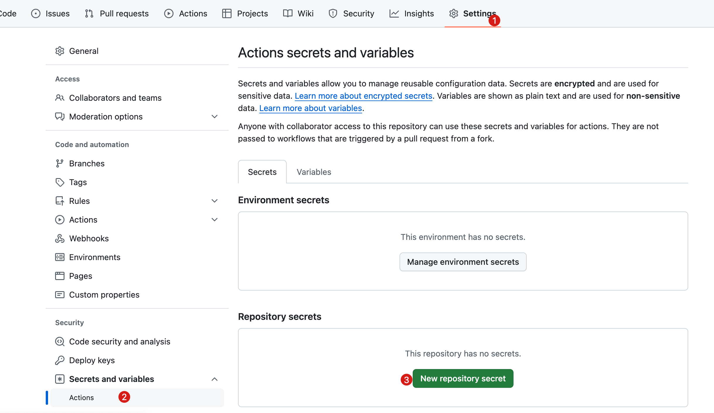
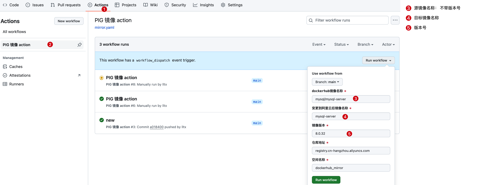

# docker-mirror

docker-mirror 是一个用于自动化操作 Docker 镜像的工具，可以方便地将指定版本的 Docker 镜像从一个 Docker 仓库（如 Docker Hub）拉取下来，重新标记（tag），并将其推送到另一个 Docker 仓库。

## 使用方法

1. Fork 本仓库到你的 GitHub 账号下。

2. 在 Fork 后的仓库中，设置 GitHub Actions 的 Repository Secrets。你需要添加以下几个密钥：

    - `DOCKER_USERNAME`: 你的 Docker 用户名。
    
    - `DOCKER_PASSWORD`: 你的 Docker 密码。
    
    - `QYWX_ROBOT_URL`: （可选）企业微信群机器人 URL。如果你想要接收自动化操作的通知，可以填写该密钥，否则可不填写。

3. 完成上述步骤后，参考下图 手动触发 GitHub Actions 将会自动触发，，docker-mirror 将会执行相应的操作。

4. 当 docker-mirror 执行完毕后，你将在你的目标 Docker 仓库中看到推送过来的镜像。

5. 如果填写了企业微信群机器人 URL，你将会收到操作的通知。

## 注意事项

- 请确保你的 Docker 用户名和密码是正确的，以便 docker-mirror 可以顺利地拉取和推送镜像。

- 如果使用企业微信群机器人接收通知，请确保机器人 URL 是正确的，并且你有权限接收该群的通知。